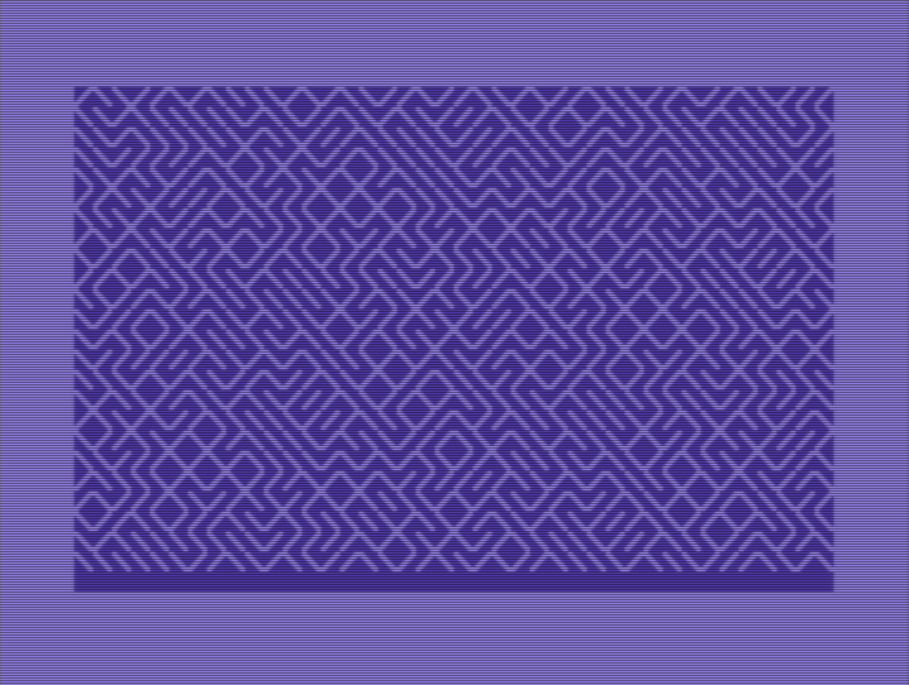

```
            ___     
 _ __ ___  ( _ )____
| '_ ` _ \ / _ \_  /
| | | | | | (_) / / 
|_| |_| |_|\___/___|
```

# m8z - maze generator for C64 in 14 bytes

## Run

```
echo 7c00 b103 c829 0169 6d20 d2ff d0f4 | xxd -r -p >m8z && x64 m8z
```

## Output



enjoy - Johan!
